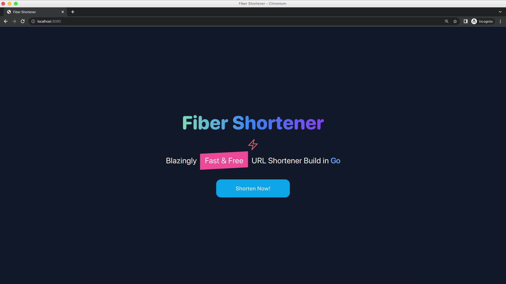
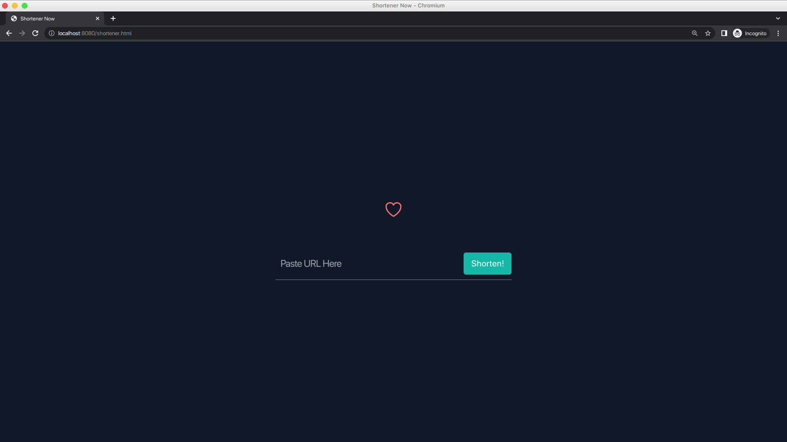
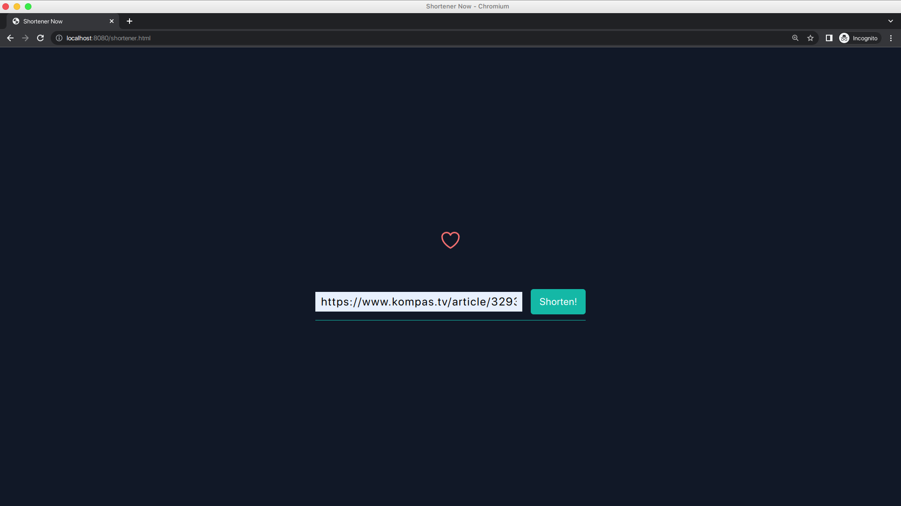
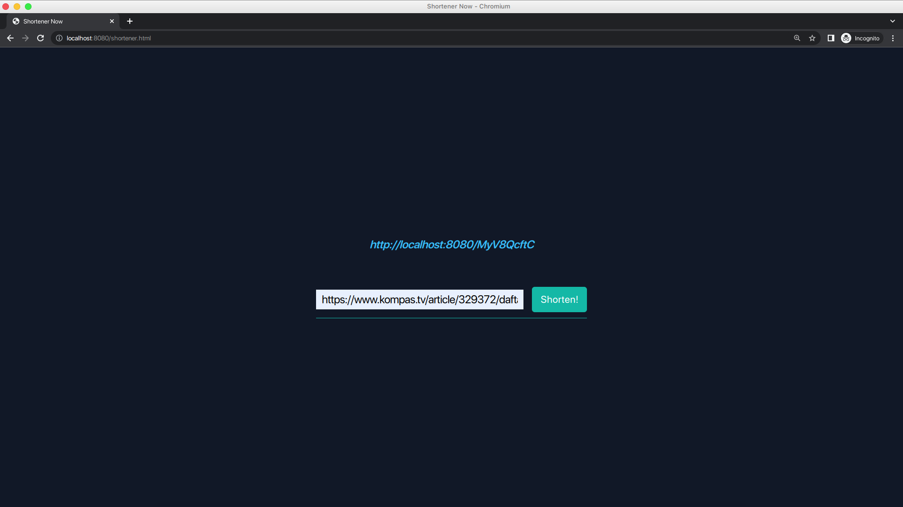

# Fiber Shortener

A simple web application to shorten urls

## Screnshoot

<div style="max-width: 720px;">






</div>

## Tech Stack

### Backend

- Golang 1.19 (Programming Language)
- Fiber (web framework)
- Postgre (main database)
- pq (Postgre driver)
- Redis (caching)
- golang-migrate (database migration)
- viper (configuration management)
- shortid (generate unique id)
- goconcurrentqueue (queue)
- sqlc (generate database query)

### Frontend

- HTML (Markup Language)
- TailwindCSS (CSS Framework)

## Development

### Prerequisites

- Golang 1.19
- Docker
- Docker-Compose
- Make
- NodeJS

### Setup

1. Clone the repository

```bash
git clone https://github.com/SemmiDev/fiber-shortener.git
```

2. Run docker-compose.dev

```bash
make up
```

3. Open `http://localhost:8080` in Browser
